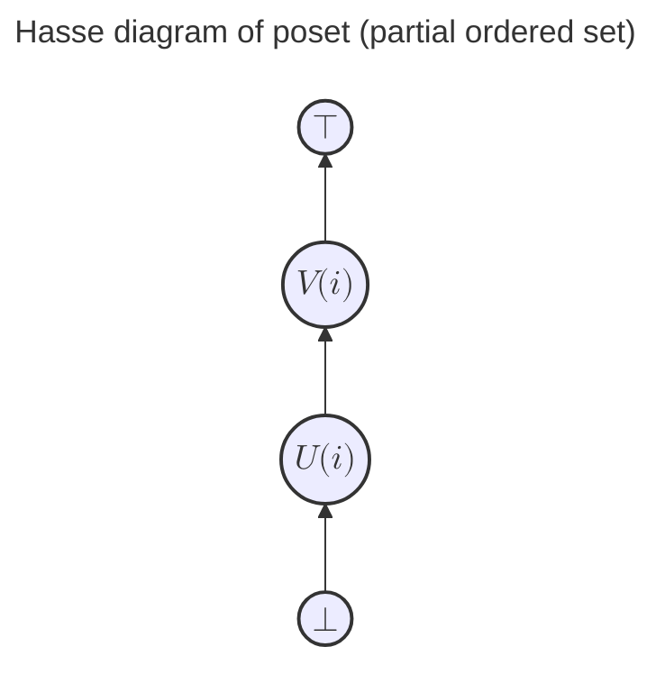
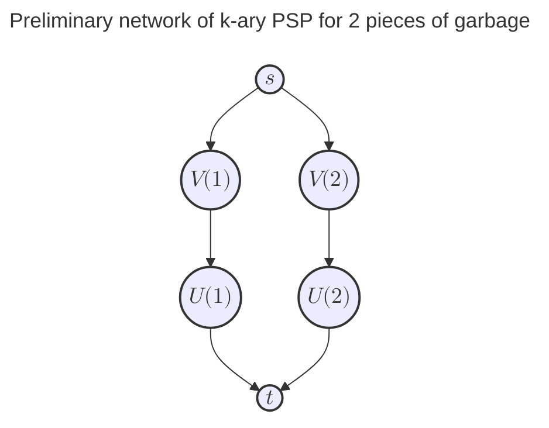
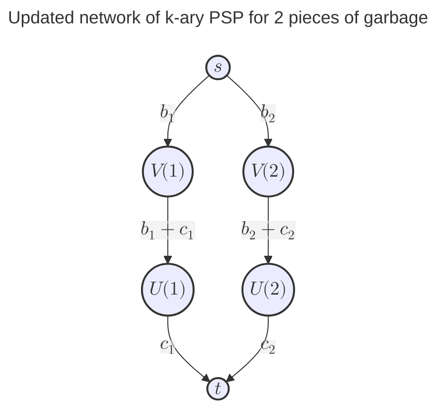
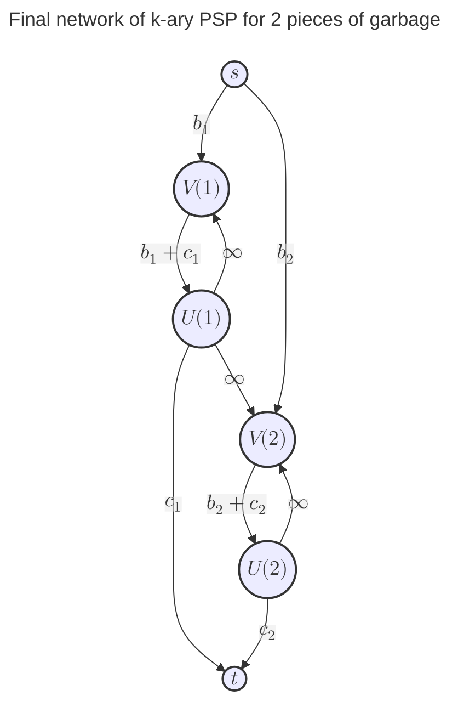
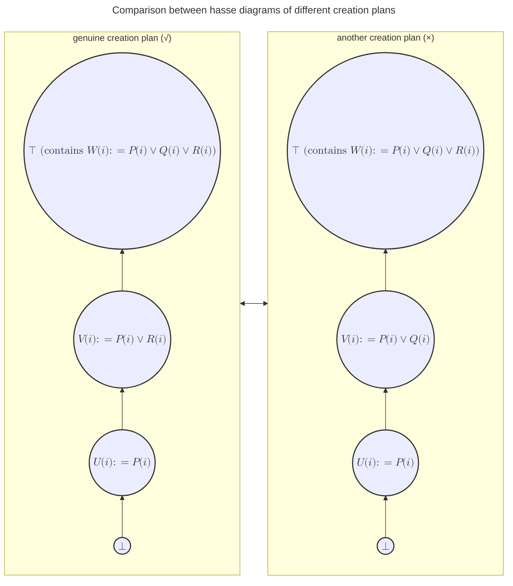
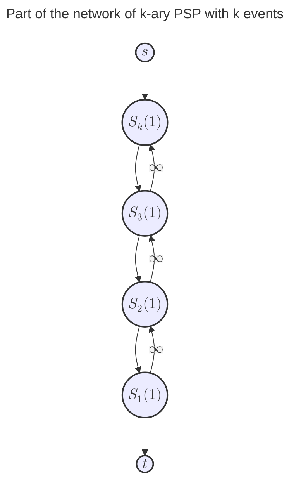
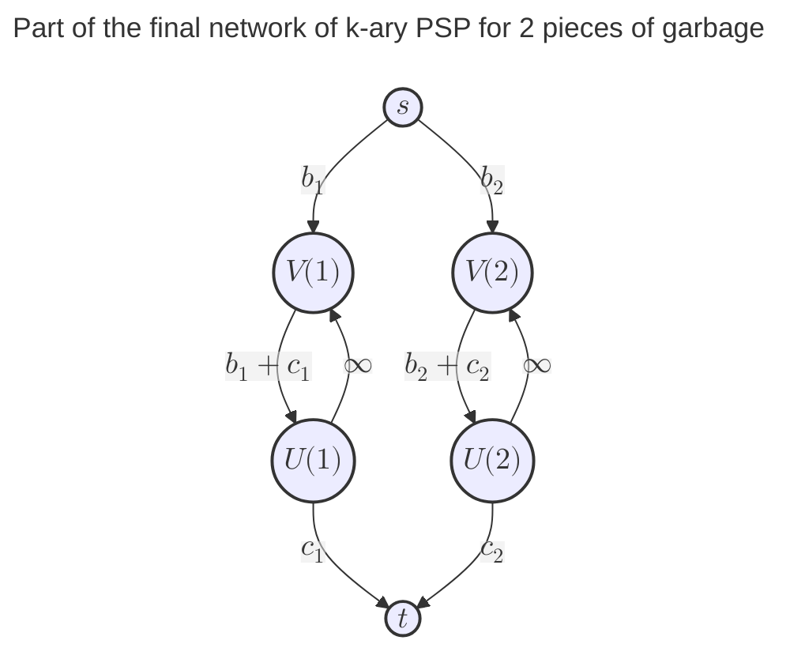

A brief introduction into k-ary PSP and its general solution.

<!-- more -->

This blog is for who has grasped the elementary knowlegde of Network Flow, e.g., Dinitz's Algorithm, Project Seletion Problem (__PSP__ for short, which's also called Maximum Weight Closure Problem of a graph), and so on.

To dive further into the topic, this blog comes with some necessary subjects of Discrete Math. 

Anyway, feel free to follow with.

## An advanced version of PSP: $k$-ary PSP

The Project Selection Problem for k-ary variables, which has another title in Japan as Burn and Bury Problem, is considered to be a special collection of problems in the field of Network Flow. It largely differs from the traditional PSP, and the problem prototype is characterized as the following:

Suppose you manage disposing a batch of $n$ pieces of garbage, and you're given the rights to freely handle them, by burning, buring or keeping each piece. The profit of different disposal is different as well. Burning a piece of garbage earns $b_i$ dollars, buring a piece of garbage earns $c_i$ dollars, and keeping a piece of garbage earns $0$ dollar.

Apart from above mentioned statements, if you decide to burn the $i$-th piece of garbage, you'd not be allowed to bury the $j$-th piece of garbage. This is the most important constraint characterizing the problem, because it draws dependencies between disposals of garbage, from which we can conclude the problem to be a Network Flow one.

At a first glace of the description of this problem when you haven't heard about the Burn and Bury Problem, you're most likely to misinterpret the problem as a PSP. As you might have recognized the dependency relationship in it, and after considerably excluding typical methods like Bruce Force, Greedy and DP, your mind natrually goes into the field of Graph Theory, and further into the subfield of Network Flow. Just after so much effort have been devoted into the problem, you'll desperately find that this problem isn't like any Network Flow problem you've dealt with before.

In PSP, any project has ONLY 2 mutually exclusive events: to be implemented or to be abandoned, which's simple enough for us to construct a graph (flow network) without being assisted with mathmatical analysis. But what if the number of events grows up to 3 or more? Just as the Burn and Bury one we're discussing, each piece of garbage has totally 3 mutually exclusive events: burnt, buried or kept. It's quite difficult to build a graph directly from the description of the problem.

By the way, the $k$-ary in the title literally means the dimension of solution variable. Even if $k$ isn't completely equal to the number of object events, it still explains well why the problem prototype is titled Project Selection Problem for $k$-ary variables.

Given that it's not possible to solve such a complex problem in a straightforward way, we need to find a way to convert it into a more tractable form. And that's sort of why we have to utilize the knowlegde of Discrete Math to solve the problem.

## Math reformulation of $k$-ary PSP

Using the expression in Predicate Logic, we can replace the 3 disposals of garbage with 3 corresponding propositions:

$$
\begin{align*}
(\forall i \in I)P(i) : \quad &\text{burn the i-th piece} \cr
(\forall i \in I)Q(i) : \quad &\text{bury the i-th piece} \cr
(\forall i \in I)R(i) : \quad &\text{keep the i-th piece}
\end{align*}
$$

where $I$ is the garbage set.

Keep in mind that all the propositions can ONLY take the value of true or false. And don't forget to write down the profit of each disposal.

| Disposal | Proposition | Profit |
| --- | --- | --- |
| Burn $i$ | $P(i)$ | $b_i$ |
| Bury $i$ | $Q(i)$ | $c_i$ |
| Keep $i$ | $R(i)$ | $0$ |

From the perspective of Probability Theory, it's obvious that the 3 events (disposals of garbage) are mutually exclusive, where we additionally have:

$$
\begin{align*}
(\forall i \in I) P(i) \lor Q(i) \lor R(i) & \Leftrightarrow 1 \cr
(\forall i \in I) P(i) \land Q(i) & \Leftrightarrow 0 \cr
(\forall i \in I) Q(i) \land R(i) & \Leftrightarrow 0 \cr
(\forall i \in I) P(i) \land R(i) & \Leftrightarrow 0 \cr
\end{align*}
$$

That's to say, there should always be ONLY 1 proposition true and the other 2 propositions false for each piece of garbage. In other words, the garbage set $I$ is to be partitioned as 3 condisjoint subsets $(I_1, I_2, I_3)$, where $I_1$ is the subset of garbage to be burnt, $I_2$ is the subset of garbage to be buried, and $I_3$ is the subset of garbage to be kept.

The $k$-ary PSP also gives a set $D$ of $(i,j)$ pairs that stands for the dependencies of disposals of garbage, where we have:

$$
\left\lbrack \forall (i, j) \in D \subseteq I^2 \right\rbrack P(i) \rightarrow \lnot Q(j) \Leftrightarrow 1
$$

The above formula means that if the $i$-th piece of garbage is burnt, then the $j$-th piece do must not be buried.

To remind you, our goal is, in other words, to find the best partition of $I$ so that the total profit of disposals of garbage is maximized.

Assumed $E_I$ is the set of all the LEGAL partiions of $I$, which has satisfied the above statements, we can define $E_I$ as:

$$
E_I := \left\lbrace (I_1, I_2, I_3) \quad \left| \quad \begin{align*} &(I_1, I_2, I_3) \text{ is a partition of } I, \cr
&(\forall i \in I_1)P(i) \Leftrightarrow 1 \cr
&(\forall i \in I_2)Q(i) \Leftrightarrow 1 \cr
&(\forall i \in I_3)R(i) \Leftrightarrow 1 \cr
&(\forall i \in I) P(i) \lor Q(i) \lor R(i) \Leftrightarrow 1 \cr
&(\forall i \in I) P(i) \land Q(i) \Leftrightarrow 0 \cr
&(\forall i \in I) Q(i) \land R(i) \Leftrightarrow 0 \cr
&(\forall i \in I) P(i) \land R(i) \Leftrightarrow 0 \cr
&\left\lbrack \forall (i, j) \in D \subseteq I^2 \right\rbrack P(i) \rightarrow \lnot Q(j) \Leftrightarrow 1 \end{align*} \right. \right\rbrace
$$

After all these statements've been packaged, we can formulate the problem as follows:

$$
\begin{align*}
\text{Maximize} &\quad \sum_{i \in I} f(i) \cr
\text{Subject to} &\quad f(i) = \left\lbrace \begin{aligned} 
& b_i & \text{if } i \in I_1 \cr
& c_i & \text{if } i \in I_2 \cr
& 0 & \text{if } i \in I_3
\end{aligned} \right. \text{, } \quad (I_1, I_2, I_3) \in E_I
\end{align*}
$$

## Transformation for being expressed in a network (graph)

In the previous section, we've given the math formulation of $k$-ary PSP, which's pretty easy to understand. But it seems unrelevant to Min-Cut Problem (PSP belongs to Min-Cut problems). In this section, we're going to transform the formulation into another version, so that $k$-ary PSP can be expressed in a flow network.

As is known that 99% effort of Min-Cut Problem is to construct an appropriate network, how can we do this ? Actually what we're ganna do in this and the following sections is to take away from the optimizing formulation some of the logical constraints and convert them as edges in network, trying to make the problem a graph-like one. In this way, we can avoid that the constructed network doesn't properly express these constraints.

But Let's just break it down into several smaller and easier steps, for the sake of simplicity.

Here's the preliminary transformed formulation of $k$-ary PSP:

$$
\begin{align*}
\text{Maximize} &\quad \sum_{i \in I} (b_i + c_i) - \sum_{i \in I} f(i) \cr
\text{Subject to} &\quad f(i) = \left\lbrace \begin{aligned} 
& c_i & \text{if } i \in I_1 \cr
& b_i & \text{if } i \in I_2 \cr
& b_i + c_i & \text{if } i \in I_3
\end{aligned} \right. \text{, } \quad (I_1, I_2, I_3) \in E_I
\end{align*}
$$

In this step, we made a little modification of $f$ so the original maximizing problem's equivalent to another problem that minimizes the subtracted portion of target function, where it can be solved by a Min-Cut solution. Especially you need to notice we didn't simply toggle the sign of target function, but we rewrite the target function into a formulation where a constant subtract a combinational group of functions, and the functions're all POSITIVE !

Why does it matter the functions're positive ? Because we want to express these functions as edges in a flow network, and we've learned capacity of an edge in flow networks should be positive. That's just the reason, and I highly recommend you to practice this principle whenever you're coping with a $k$-ary PSP, to make sure your solution can be expressed into a network.

Let's move on to the next step. The piecewise function $f$ seems unlikely to be expressed in a network, what about we make it an addtion of 3 functions $f_1 + f_2 +f_3$, of which each function represents a type of disposal ?

$$
\begin{align*}
\text{Maximize} &\quad \sum_{i \in I} (b_i + c_i) - \left \lbrack \sum_{i \in I_1} f_1(i) + \sum_{i \in I_2} f_2(i) + \sum_{i \in I_3} f_3(i) \right \rbrack \cr
\text{Subject to} &\quad f_1(i) = c_i \cr
&\quad f_2(i) = b_i \cr
&\quad f_3(i) = b_i + c_i \cr
&\quad (I_1, I_2, I_3) \in E_I
\end{align*}
$$

Given that we're ganna add some logical constraints into the target function, more specifically, we want to add them into the combinational function group which is also the substracted portion in the target function. So the partition plan $(I_1, I_2, I_3)$ should be decided inside these combinational functions as well.

Based on this idea, we need to modify the formulation again:

$$
\begin{align*}
\text{Maximize} &\quad \sum_{i \in I} (b_i + c_i) - \left \lbrack \sum_{i \in I} f_1(i) + \sum_{i \in I} f_2(i) + \sum_{i \in I} f_3(i) \right \rbrack \cr
\text{Subject to} &\quad f_1(i) = P(i)c_i \cr
&\quad f_2(i) = Q(i)b_i \cr
&\quad f_3(i) = R(i)(b_i + c_i) \cr
&\quad (I_1, I_2, I_3) \in E_I
\end{align*}
$$

You may be wondering why we need to add $P(i)$, $Q(i)$ and $R(i)$ into the combinational functions. What's the difference between the 2 versions?

As for the 2nd one, imagine we express $f_1(i)$ as an edge of weight $c_i$, then the algorithm'll decide whether to flow through the edge or not. That's to say, the algorithm will decide whether to burn the $i$-th piece of garbage or not. So the latter formulation version gives the power of decision to the program, and not our humans. That's where the problem can be solved by a Min-Cut solution. Therefore, the latest formulation is apparently better.

To some extends, the formulation promises a potential for the problem being expressed in a network.

## Modification for adding constraints into network

You've been told to solve $k$-ary PSP using a Min-Cut solution. So if we can run a program for the following problem:

$$
\begin{align*}
\text{Minimize} &\quad \sum_{i \in I} f_1(i) + \sum_{i \in I} f_2(i) + \sum_{i \in I} f_3(i) \cr
\text{Subject to} &\quad f_1(i) = P(i)c_i \cr
&\quad f_2(i) = Q(i)b_i \cr
&\quad f_3(i) = R(i)(b_i + c_i) \cr
&\quad (I_1, I_2, I_3) \in E_I
\end{align*}
$$

And we substract the result of program from the constant $\sum_{i \in I} (b_i + c_i)$, then it's exactly the answer for $k$-ary PSP.

So far as we're striving to express the formulation in a network, we've not yet got an intuitive way to implement it. At present it's impossible to directly express the combinational functions as edges, since it's unclear about how we can add mutually exclusive relationships and dependencies of disposals into network.

There's an even more subtle point of reason we've not discussed before. The genuine solution of $k$-ary PSP in this blog is a Min-Cut one, but if we express the combinational functions as edges and let the program decide whether to flow through the edges or not, then the algorithm of this program will be kind of like a Max-Flow solution instead of a Min-Cut one.

As the goal of Min-Cut Problem is to remove some edges from network, while the goal of Max-Flow Problem is to decide optimal loads of flow on all edges, the transformation between the 2 problems seems easy (by Max-Flow Min-Cut theorem), but in fact is quite complicated and takes a long way to go, especially for $k$-ary PSP. And our work in this section is to come up with such a transformation.

The initial idea of expression in network is implicit, where we can't find a clue of Min-Cut attributes. As you're advancing to find a way of transformation, suddenly you may want to give a try to replace the original propositions with the following new ones:

$$
\begin{align*}
(\forall i \in I) U(i) &:= (\forall i \in I) P(i) \cr
(\forall i \in I) V(i) &:= (\forall i \in I) P(i) \lor R(i) \cr
(\forall i \in I) W(i) &:= (\forall i \in I) P(i) \lor Q(i) \lor R(i)
\end{align*}
$$

Before we discuss why these new propositions're created in such way, let's first count out benefits of the replacement.

Immediately you'll find that these new variables you just created forms a linear order:

Here, The higher a proposition is in the diagram, the closer the proposition is to be true. $\top$ means the proposition that is always true, and $\bot$ means the null proposition that is always false.

By the way, as is previously shown in $E_I$, the new proposition $(\forall i \in I)W(i)$ is always true:

$$
(\forall i \in I) W(i) := (\forall i \in I) P(i) \lor Q(i) \lor R(i) \Leftrightarrow 1
$$

Thus $(\forall i \in I)W(i)$ is implicitly involved in $\top$.

Now it's time to construct a network! 

Assumed we have 2 pieces of garbage to be disposed, and the 2nd piece can't be buried if the 1st piece is burnt, then we can construct a network with 1 source $s$ and 1 sink $t$ as shown below:

I fully understand that you may be confused about how we can construct this network so unintuitively. But here you should merely accept this network, its essence flowing into your mind as you keep moving on.

As you can guess, the network is constructed from the hasse diagram, where we reverse directions of the edges in the hasse diagram for each piece of garbage.

Do you still remember the latest version of $k$-ary PSP? In that version, we've modified the forms of the 3 combinational functions $f_1$, $f_2$ and $f_3$. We need to modify them further by making use of the new propositions $(\forall i \in I)U(i)$, $(\forall i \in I)V(i)$ and $(\forall i \in I)W(i)$:

$$
\begin{aligned}
f_1(i) &= P(i)c_i = U(i)c_i = \lnot (U(i) \rightarrow \bot)c_i \cr
f_2(i) &= Q(i)b_i = \lnot V(i)b_i = \lnot (\top \rightarrow V(i))b_i \cr
f_3(i) &= R(i)(b_i + c_i) = \lnot (V(i) \rightarrow U(i)) (b_i + c_i) \cr
\end{aligned}
$$

These combinational functions become 3 types of edges in the network. Take $f_1(i)$ as an example, if the proposition $U(i) \rightarrow \bot$ was not satisfied, which means the edge $U(i) \rightarrow t$ was cut out from the network, then $f_1(i)$ will be $c_i$, otherwise it will be $0$. The same way for $f_2(i)$ and $f_3(i)$.

Don't forget these 3 types of edges also correspond to the 3 initial propositions $(\forall i \in I)P(i)$, $(\forall i \in I)Q(i)$ and $(\forall i \in I)R(i)$, so each edge type represents a type of garbage disposal as well. 

Then the formulation of $k$-ary PSP becomes:

$$
\begin{align*}
\text{Minimize} &\quad \sum_{i \in I} f_1(i) + \sum_{i \in I} f_2(i) + \sum_{i \in I} f_3(i) \cr
\text{Subject to} &\quad f_1(i) = \lnot (U(i) \rightarrow \bot)c_i \cr
&\quad f_2(i) = \lnot (\top \rightarrow V(i))b_i \cr
&\quad f_3(i) = \lnot (V(i) \rightarrow U(i)) (b_i + c_i) \cr
&\quad (I_1, I_2, I_3) \in E_I
\end{align*}
$$

The formulation above is a Min-Cut problem, because the target function would be minimized only if the edges $U(i) \rightarrow t$, $s \rightarrow V(i)$ and $V(i) \rightarrow U(i)$ are cut as less as possible.

Based on the formulation, the weight of each edge corresponds to the coefficient of each combinational function. With edge weights filled, the network is shown below:

Congratulation! We've accomplished almost half the transformation work. 

The rest is to complete the mutual exclusive relationships and dependencies of disposals in this network, that're propositional constraints in $E_I$. As what we've done for combinational functions, we need to replace the inital propositions in $E_I$ with the new ones.

Let's first consider the dependencies of disposals. With the conclusion $(\forall i \in I)\lnot Q(i) \rightarrow (P(i) \lor R(i)) \Leftrightarrow (\forall i \in I) P(i) \lor Q(i) \lor R(i) \Leftrightarrow 1$, we can also derive a new constraint $\left\lbrack \forall (i, j) \in D \subseteq I^2 \right\rbrack U(i) \rightarrow V(j) \Leftrightarrow 1$ from its original form:

$$
\begin{aligned}
& \left\lbrack \forall (i, j) \in D \subseteq I^2 \right\rbrack P(i) \rightarrow \lnot Q(j) \cr
\Leftrightarrow & \left\lbrack \forall (i, j) \in D \subseteq I^2 \right\rbrack \lnot P(i) \lor \lnot Q(j) \cr 
\Rightarrow & \left\lbrack \forall (i, j) \in D \subseteq I^2 \right\rbrack \lnot U(i) \lor (P(j) \lor R(j)) \quad \text{(Hypothesis Inference)}\cr
\Leftrightarrow & \left\lbrack \forall (i, j) \in D \subseteq I^2 \right\rbrack \lnot U(i) \lor V(j) \cr
\Leftrightarrow & \left\lbrack \forall (i, j) \in D \subseteq I^2 \right\rbrack U(i) \rightarrow V(j) \cr
\Leftrightarrow & 1
\end{aligned}
$$

The mutual exclusive relationships of disposals should be replaced using the new propositions in the same way. The constraint $(\forall i \in I)W(i) := (\forall i \in I) P(i) \lor Q(i) \lor R(i) \Leftrightarrow 1$ has been implicitly involved in the network, so we just remove it from $E_I$. As for the following constraints:

$$
\begin{aligned}
&(\forall i \in I) P(i) \land Q(i) \Leftrightarrow 0 \cr
&(\forall i \in I) Q(i) \land R(i) \Leftrightarrow 0 \cr
&(\forall i \in I) P(i) \land R(i) \Leftrightarrow 0
\end{aligned}
$$

The 1st constraint can be replaced by the following:

$$
(\forall i \in I) U(i) \rightarrow V(i) \Leftrightarrow 1
$$

The other 2 constraints make no sense after the replacement, so we can simply remove them from $E_I$.

We finally derived 2 new constraints for expressing the mutual exclusive relationships and dependencies of disposals in the network:

$$
\begin{aligned}
\left\lbrack \forall (i, j) \in D \subseteq I^2 \right\rbrack U(i) \rightarrow V(j) & \Leftrightarrow 1 \cr
(\forall i \in I)U(i) \rightarrow V(i) & \Leftrightarrow 1
\end{aligned}
$$

These propositional constraints can be directly added into the network as edges. 

The formualtion of $k$-ary PSP can be updated as:

$$
\begin{align*}
\text{Minimize} &\quad \sum_{i \in I} f_1(i) + \sum_{i \in I} f_2(i) + \sum_{i \in I} f_3(i) \cr
\text{Subject to} &\quad f_1(i) = \lnot (U(i) \rightarrow \bot)c_i \cr
&\quad f_2(i) = \lnot (\top \rightarrow V(i))b_i \cr
&\quad f_3(i) = \lnot (V(i) \rightarrow U(i)) (b_i + c_i) \cr
&\quad \left\lbrack \forall (i, j) \in D \subseteq I^2 \right\rbrack U(i) \rightarrow V(j) \Leftrightarrow 1 \cr
&\quad (\forall i \in I)U(i) \rightarrow V(i) \Leftrightarrow 1 \cr
&\quad (I_1, I_2, I_3) \in E_I^*
\end{align*}
$$

where

$$
E_I^* := 
\left\lbrace 
(I_1, I_2, I_3) \quad 
\left| \quad \begin{align*} &(I_1, I_2, I_3) \text{ is a partition of } I, \cr
&(\forall i \in I_1)U(i) \rightarrow \bot \Leftrightarrow 0 \cr
&(\forall i \in I_2)\top \rightarrow V(i) \Leftrightarrow 0 \cr
&(\forall i \in I_3)V(i) \rightarrow U(i) \Leftrightarrow 0
\end{align*} \right. 
\right\rbrace
$$

In our example, the 1st of the 2 replaced constraints $\left\lbrack \forall (i, j) \in D \subseteq I^2 \right\rbrack U(i) \rightarrow V(j) \Leftrightarrow 1$ is simply a proposition $U(1) \rightarrow V(2) \Leftrightarrow 1$ or an edge $U(1) \rightarrow V(2)$ in the network. 

And the 2nd replaced constraint $(\forall i \in I)U(i) \rightarrow V(i) \Leftrightarrow 1$ can be expressed as 2 edges $U(1) \rightarrow V(1)$ and $U(2) \rightarrow V(2)$ in the network.

Given that the constraints represented by these edges $U(1) \rightarrow V(2)$, $U(1) \rightarrow V(1)$ and $U(2) \rightarrow V(2)$ should always be satisfied, so these 3 edges can't be cut out from the network, which means the weights of these 3 edges are all $\infty$ ($\infty$ is a real number that is large enough to become impossible to be cut out).

With the edges that represents mutual exclusive relationships of disposals for the same piece of garbage added into the network, there'll be only 1 disposal selected for each piece of garbage, as in the network, there'll be only 1 cut edge for the same piece of garbage. And the dependencies of disposals are also expressed in the network. Therefore, the network'll be fully constructed.

Then the final network is shown below:

The network is now ready to be solved by a Min-Cut algorithm. To make it more clear, I'll write down the formulation of the converted Min-Cut problem.

Let $G = (N, E)$ be a network, where $N = \lbrace s, t \rbrace \cup \lbrace U(i) | i \in I \rbrace \cup \lbrace V(i) | i \in I \rbrace$ is the node set, and $E$ is the set of edges that has the following:

1. For the $i$-th piece of garbage, there are 3 edges $s \rightarrow U(i)$ weighted as $b_i$, $U(i) \rightarrow V(i)$ weighted as $b_i + c_i$ and $V(i) \rightarrow s$ weighted as $c_i$;
2. For expressing the mutual exclusive relationships between disposals of the same garbage piece $i$, there is an edge $U(i) \rightarrow V(i)$ weighted as $\infty$;
3. For each of the dependency constraint $\left\lbrack \forall (i, j) \in D \subseteq I^2 \right\rbrack P(i) \rightarrow \lnot Q(j)$, there is an edge $U(i) \rightarrow V(j)$ weighted as $\infty$.

If $\text{Cut(S, T)}$ is a function to partion $G$ as 2 divided subgraphs $S$ and $T$, and it returns the sum of weights of cut edges, then the Min-Cut problem can be expressed as:

$$
\begin{aligned}
\text{Minimize} &\quad \text{Cut(S, T)} \cr
\text{Subject to} &\quad \text{G is the constructed network}
\end{aligned}
$$

The answer for this example problem is $b_1 + b_2 + c_1 + c_2 - \text{Min-Cut(S,T)}$.

As you can see, creating a linear ordered set of new propositions $(\forall i \in I)U(i)$, $(\forall i \in I)V(i)$ and $(\forall i \in I)W(i)$ is undoubtably a great idea to deal with the unlikelyhood of expression of mutual exclusive relationships and dependencies of disposals.

But the progress of constructing this network seems way too complicated and fullfilled with coincidence. What's the principle or theory under the progress? Can we use a more general and eaiser approach to simplify the construction?

The following sections're gonna unlock these mysteries.

## Explanation and summary of the construction method

I was about to make every reasoning step of the construction method clear and plain. However, there's a big gap between practice and theory, as the construction involves the proof of isomorphism of submodular systems (e.g., the Monge Array, Min-Cut algorithms) and the knowledge of order theory, lattice algebra and boolean algebra. (I don't know if it's the time to say I haven't learned them of all yet... but don't worry, I promise my explanation is still clear and concise enough for you to put it into practice.)

Some blogs tried to explain the construction method in a very abstract way, leaving thinking and reasoning between the steps too vague. To avoid too much confusion, I'll get out of the traditional explanation and give you a blueprint of my personal reasoning about the construction method.

First thing first, let's answer the earlest question I left in the last section. Why were $(\forall i \in I)U(i)$, $(\forall i \in I)V(i)$ and $(\forall i \in I)W(i)$ created in such way instead of others:

You may have noticed $(\forall i \in I)V(i)$ in the genuine creation plan is different from one in the right-side plan. If you're willing to try that right-side plan, you'll find that the final network couldn't express the constraint $\left\lbrack \forall (i, j) \in D \subseteq I^2 \right\rbrack P(i) \rightarrow \lnot Q(j)$ as an edge.

So how did I choose the genuine creation plan? There's a more detailed progress for making this choice. In one word, Monge Array'll help us.

Let's take a look at the definition of Monge Array. if $A$'s an $m \times n$ array of real numbers, and $\forall (i, j, k, l)$ with 

$$
A\lbrack i, j \rbrack + A\lbrack k, l \rbrack \leq A\lbrack i, l \rbrack + A\lbrack k, j \rbrack
$$

, then $A$ is called a Monge Array. i.e., whenever you choose 2 rows and 2 columns of the Monge Array, the sum of elements at the upper-left and bottom-right of the intersection of these rows and columns is always no larger than the sum of the elements at the upper-right and bottom-left of the intersection.

To be able to create linear ordered disjunctions of the initial propositions for any $k$-ary PSP, we have to build a 2D table axised by the initial propositions and make sure the 2D table is a Monge Array. You won't need to wait for too long to understand the meaning of this table.

To remind you again, the reason why we should create these new propositions, other than to using the initial propositions directly, is that we can't express the mutual exclusive relationships and dependencies of disposals into the network without the new propositions. But if you're willing to try constructing a network for that right-side plan, you'll find that the mutual exclusive relationships of disposals are also expressable into network.

In fact, there's a truth that no matter how you create new propositions that're disjunctions of the initial propositions, the mutual exclusive relationships of disposals will always be expressable into the network. As for our example, both the creation plans above can express the mutual exclusive relationships of disposals into network. So the only distinguishing factor between the 2 plans is whether a creation plan can express the dependencies of disposals into network.

Back to creating the 2D table, which's also a Monge Array, what do the elements in the 2D table represent?

To summarize, they're values of a special function that accounts for the dependencies of disposals, as the goal of our work is to find a disjunction creation plan of the initial propositions for expressing the dependencies of disposals into network.

This special function is defined as:

$$
g(i, j) = \lnot(P(i) \rightarrow \lnot Q(j))\infty
$$

If any dependency of disposals $P(i) \rightarrow \lnot Q(j)$ is statisfied, then $g(i, j) = 0$, otherwise $g(i, j) = \infty$.($\infty$ should just be a big real number.) With the special function, the math formulation of $k$-ary PSP can be transformed as well.

Here's the streamlined math formulation of $k$-ary PSP we've discussed at the beginning of last section:

$$
\begin{align*}
\text{Minimize} &\quad \sum_{i \in I} f_1(i) + \sum_{i \in I} f_2(i) + \sum_{i \in I} f_3(i) \cr
\text{Subject to} &\quad f_1(i) = P(i)c_i \cr
&\quad f_2(i) = Q(i)b_i \cr
&\quad f_3(i) = R(i)(b_i + c_i) \cr
&\quad (I_1, I_2, I_3) \in E_I
\end{align*}
$$

It'll be transformed into the following form if we add the special function $g(i,j)$:

$$
\begin{align*}
\text{Minimize} &\quad \sum_{i \in I} f_1(i) + \sum_{i \in I} f_2(i) + \sum_{i \in I} f_3(i) + \sum_{i \in I}\sum_{j \in I}g(i, j) \cr
\text{Subject to} &\quad f_1(i) = P(i)c_i \cr
&\quad f_2(i) = Q(i)b_i \cr
&\quad f_3(i) = R(i)(b_i + c_i) \cr
&\quad g(i, j) = \lnot(P(i) \rightarrow \lnot Q(j))\infty \cr
&\quad (I_1, I_2, I_3) \in E_I^- 
\end{align*}
$$

where $E_I^-$ is defined as the following:

$$
E_I^- := \left\lbrace (I_1, I_2, I_3) \quad \left| \quad \begin{align*} &(I_1, I_2, I_3) \text{ is a partition of } I, \cr
&(\forall i \in I_1)P(i) \Leftrightarrow 1 \cr
&(\forall i \in I_2)Q(i) \Leftrightarrow 1 \cr
&(\forall i \in I_3)R(i) \Leftrightarrow 1 \cr
&(\forall i \in I) P(i) \lor Q(i) \lor R(i) \Leftrightarrow 1 \cr
&(\forall i \in I) P(i) \land Q(i) \Leftrightarrow 0 \cr
&(\forall i \in I) Q(i) \land R(i) \Leftrightarrow 0 \cr
&(\forall i \in I) P(i) \land R(i) \Leftrightarrow 0 \cr
\end{align*} \right. \right\rbrace
$$

In this formulation, if any dependency of disposals $P(i) \rightarrow \lnot Q(j)$ isn't statisfied, then $g(i, j) = \infty$, making the problem unsolvable. Otherwise, $g(i, j) = 0$, where it does nothing to the problem. (The special function $g(i,j)$ also provides us with a good math explanation about why the weight of edge $U(i) \rightarrow V(j)$ in last section is $\infty$.)

Then I'll show you what does the 2D table look like for our example problem:

| $g(i, j)$ | $P(j) \Leftrightarrow 1$ | $Q(j) \Leftrightarrow 1$ | $R(j) \Leftrightarrow 1$ |
| --- | --- | --- | --- |
| $P(i) \Leftrightarrow 1$ | 0 | $\infty$ | 0 |
| $Q(i) \Leftrightarrow 1$ | 0 | 0 | 0 |
| $R(i) \Leftrightarrow 1$ | 0 | 0 | 0 |

In this table, we assume all events of any piece of garbage are true. So if there's such a condition when $P(i)$ and $Q(j)$ are both $1$, but the problem also has a constraint $P(i) \Rightarrow \lnot Q(j)$, the $g(i,j)$ would be $\infty$. 

As you can see, the 2D table isn't a Monge Array. So we need to reshape it into a Monge Array (just to make sure every $2\times 2$ submatrix with rows and columns originally adjacent in the table is a Monge Array):

| $g(i, j)$ | $P(j) \Leftrightarrow 1$ | $R(j) \Leftrightarrow 1$ | $Q(j) \Leftrightarrow 1$ |
| --- | --- | --- | --- |
| $P(i) \Leftrightarrow 1$ | 0 | 0 | $\infty$ |
| $R(i) \Leftrightarrow 1$ | 0 | 0 | 0 |
| $Q(i) \Leftrightarrow 1$ | 0 | 0 | 0 |

We change both the orders of rows and columns of the 2D table, so that this 2D table is made a Monge Array. Therefore, the order of indexes is changed, which indicates the disjunction order of these propositions is changed in the same way. This's how we derive the disjunction order of the initial propositions for creating new propositions, from which we can express the mutual exclusive relationships of disposals into the network as $U(i) \rightarrow V(j)$.

But if there're more than 1 kind of dependency constraints, the technique of Monge Array would be unable to help us. In fact, any $k$-ary PSP would have merely 1 kind of dependency constraint, so we can just use the same technique as above.

There's still a question left to be answered: why any creation plan of new propositions that're linear ordered disjunctions of the initial propositions can express the mutual exclusive relationships of disposals into the network?

Well, to be honest, it's quite a big challenge to answer this question, as there's been not yet a good math explanation for it. (But there're several papers related to the topic, from which you may learn about the theory to prove our conclusion, e.g. [S. Živný, D. A. Cohen and P. G. Jeavons. The Expressive Power of Binary Submodular Functions. Discrete Applied Mathematics, 157(15):3347–3358, 2009](https://www.sciencedirect.com/science/article/pii/S0166218X09002819))

Even though I can't strictly prove it, you can still guess the reason. Before we constructed the preliminary network, we drew a Hasse diagram of new propositions. At that time, I didn't fully explain the details behind it. But now seems the time for us to discuss the Hasse diagram further.

The Hasse diagram for our example problem has 2 middle nodes, which are $U(i)$ and $V(i)$. In fact, if a $k$-ary PSP has $k$ mutual exclusive events, then the Hasse diagram of new propositions will always have $k-1$ middle nodes.

And I'll show you another truth behind expressing the mutual exclusive relationships of disposals into the network: the edges representing the mutual exclusive relationships of disposals are just the edges of middle nodes in the Hasse diagram, as they sharing the same positions and directions. 

And the weights of these edges should be $\infty$. This can be mathmatically explained by creating some new functions, just like $g(i,j)$ shows weights of the edges representing the dependencies of disposals are $\infty$.

So if you meet with a $k$-ary PSP of $k$ mutual exclusive events, after creating new propositions using the technique of Monge Array, the edges representing the mutual exclusive relationships of disposals are apparently the edges of middle nodes in the Hasse diagram, with weights of $\infty$, like this:

Given that the edges representing the mutual exclusive relationships of disposals are just the middle edges in the Hasse diagram, no matter how you compose the linear order of disjunctions of the initial propositions, the mutual exclusive relationships of disposals are always expressable into the network.

There's something more about the Hasse digram. After reversing the directions of edges in the Hasse diagram, we'll get a preliminary network. We've already known that each middle node represents a disjunction of the initial propositions. But what I didn't tell you is each reversed edge represents an initial proposition. (Some of you may have guessed it from weights of the edges.)

The edge $s \rightarrow V(1)$ means the event $Q(1)$, $V(1) \rightarrow U(1)$ means $R(1)$, and $U(1) \rightarrow t$ means $P(1)$. 

$Q(1)$, $R(1)$, $P(1)$, their order is actually the reversion of the linear order for creating new propositions: $P(1)$, $R(1)$, $Q(1)$. And the weights of these edges correspond to the weights of the events we defined in $f_2$, $f_3$ and $f_1$.

Using all the tricks we've discussed in this section, you can mostly construct a network for a $k$-ary PSP without having to waste time on math derivation, e.g., creating new propositions for expressing dependencies of disposals, expressing single event as an weighted edge, and expressing mutual dependency relashionships as edges of $\infty$ weight.

Now it's time for us to customize and streamline the whole procedure of solving a $k$-ary PSP:

1. Recognize all mutual exclusive events in problem.

In our example, we have 3 mutual exclusive events: $(\forall i \in I)P(i)$, $(\forall i \in I)Q(i)$ and $(\forall i \in I)R(i)$.

2. Quickly write down a rough math formulation of the problem, with a special function $\phi(i,j)$ included.

In our example, the rough math formulation of the problem can be written as:

$$
\begin{align*}
\text{Minimize} &\quad \sum_{i \in I} \theta(i) + \sum_{i < j}\phi(i, j) \cr
\text{Subject to} &\quad \theta(i) = \left\lbrace \begin{aligned} 
& c_i & \text{if } i \in I_1 \cr
& b_i & \text{if } i \in I_2 \cr
& b_i + c_i & \text{if } i \in I_3
\end{aligned} \right. \cr
&\quad \phi(i, j) = \left\lbrace \begin{aligned} 
& 0 & \text{if } i < j \cr
& \infty & \text{otherwise}
\end{aligned} \right. 
\end{align*}
$$

You may have seen such formulation in other blogs and tutorials. This is the conventional way of writing down a rough math formulation of a $k$-ary PSP, and it's nothing different from mine except for the symbols.

3. Use the technique of Monge Array to create new propositions that're linear ordered disjunctions of the initial propositions, for expressing dependencies between events.

In our example, we derive 

$$
\begin{align*}
(\forall i \in I)U(i) &:= (\forall i \in I)P(i) \cr
(\forall i \in I)V(i) &:= (\forall i \in I)P(i)\lor R(i)
\end{align*}
$$

4. Create a preliminary network, which contains edges representing the single events, by reversing all edges in Hasse diagram and filling their weights with coefficients of $\theta(i)$ corresponding to initial propositions in reversed linear order of last step, and edges representing the mutual exclusive events, by using the edges of middle nodes in Hasse diagram and filling their weights with $\infty$.
  
In our example, it's like:

5. add edges representing the dependencies of disposals into network, by math inferencing them into forms with new propositions and filling their weights with coefficients of $\phi(i,j)$.

In our example, it's the derivation from $\left\lbrack \forall (i, j) \in D \subseteq I^2 \right\rbrack P(i) \rightarrow \lnot Q(j) \Leftrightarrow 1$ into $\left\lbrack \forall (i, j) \in D \subseteq I^2 \right\rbrack U(i) \rightarrow V(j) \Leftrightarrow 1$. Then we get the final network:

Finally, the streamlined network construction procedure for solving a $k$-ary PSP is completed as above.

Is here the end ?

Okay, it should be. But there's a little bit more to tell you, in case you would misunderstand $k$-ary PSP after reading this article.

## Limitation and generalization of the construction method

Before I write this article, I was wondering whether a PSP is a $k$-ary PSP, or in turn. Now I have to admit I can't make it clear without the foundation of advanced math theory.

However, math, in my opinion, is a very powerful tool, but it can costs months and years to master. 

So the work in this article will be the temporary end of the research about $k$-ary PSP. (Many other blogs cover some deeper math perspectives of $k$-ary PSP, e.g., [燃やす埋める問題と劣モジュラ関数のグラフ表現可能性 その①](https://theory-and-me.hatenablog.com/entry/2020/03/13/180935)) But I can still offer you some of my personal thinking about $k$-ary PSP. 

Generally, a PSP would have ONLY 2 events (like implemented and abandoned) but more than 1 objects (like projects and machines), while a $k$-ary PSP would have more than 2 events, but ONLY 1 object.

And events of a $k$-ary PSP would be mutual exclusive, while events of a PSP usually won't need to be.

However, some PSPs can be interpreted as $k$-ary PSPs, by trying to imagine their events as the created new propositions in $k$-ary PSP. Then you'll be able to solve a PSP using the same method as solving a $k$-ary PSP.

This may bring us a new perspective of understanding the relationship between PSP and $k$-ary PSP.

Further more, the $k$-ary PSP I introduced to you isn't completely the whole concept of $k$-ary PSP. It largely accords with the concept of $k$-ary PSP, but it's still a specialization of $k$-ary PSP though.

There's no way to cover every variant of $k$-ary PSP, but I hope this article can help you basically understand the concept of $k$-ary PSP, and the thinking behind its solution.

There're some problems that can be solved after reading this article. [yukicoder No.119](https://yukicoder.me/problems/no/119) is a problem for beginners to practice solving a $k$-ary PSP. And I would recommend [ABC347-G problem](https://atcoder.jp/contests/abc347/tasks/abc347_g) if you're willing to further broaden your insights about $k$-ary PSP.